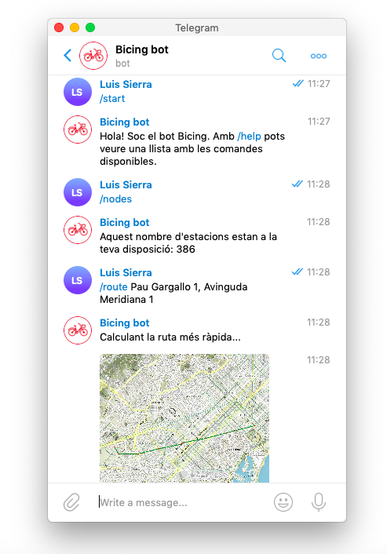

# AP2_Bicing

Aquest projecte és el BicingBot de l'assignatura d'Algorísmia i Programació 2 del Grau en Ciència i Enginyeria de Dades de la UPC, any 2019. El projecte es basa en crear un bot per l'aplicació de missatgeria Telegram que informi sobre l'estat del servei de bicicletes Bicing a Barcelona en temps real.

## Introducció

Per fer servir el bot, els usuaris el poden buscar a telegram sota l'identificador @Bicing_AP2_bot.

Alternativament, es pot buscar en el web amb la direcció [t.me/Bicing_AP2_bot](https://t.me/Bicing_AP2_bot)

Les dades de les estacions de bici estan extretes del web de bicing, que es pot veure a la següent direcció url:
[https://api.bsmsa.eu/ext/api/bsm/gbfs/v2/en/station_information](https://api.bsmsa.eu/ext/api/bsm/gbfs/v2/en/station_information)

### Prerrequisits

El cos d'aquest projecte està escrit íntegrament en Python 3, a més d'utilitzar mòduls i interfícies externes. Per tal de poder fer-lo servir, un cop s'ha instal·lat Python 3, cal descarregar les components incloses en l'arxiu `requirements.txt`, on la manera més senzilla de fer-ho és amb la següent comanda a la terminal.

```sh
pip3 install -r requirements.txt
```

I així s'instal·les tots els mòduls i APIs necessàries pel funcionament del codi.

### Instal·lació

Per baixar-se el contingut d'aquest repositori, des de la terminal de comandes cal escriure:

```sh
git clone https://github.com/Sierra17/AP2_Bicing.git
```

I per actualitzar el contingut, mentre es trobi dins el directori

```sh
git pull
```

### Arquitectura del sistema

El projecte està construït al voltant de l'objecte `Graph` de la llibreria `Networkx`; és sobre aquest graf que es fan les operacions de cerca i altres funcionalitats del bot. El projecte en si consta de dos mòduls:

> `data.py` - conté tot el codi referent al tractament de les dades, la construcció del graf i els càlculs sobre aquest graf, com ara construir el graf geomètric o trobar rutes. 

> `bot.py` - conté tot el codi referent al funcionament del bot de Telegram

## Exemple d'utilització

Per util·litzar el bot, com s'ha indicat en la introducció, és preferible trobar-lo a Telegram com @Bicing_AP2_bot.
Per pujar el bot i control·lar el sue funcionament intern cal un `token` especific i, per tant, no és possible fer-ho sense el permís dels creadors del repositori.

Les commandes que pot rebre el bot són les següents:

- `/start` -- Inicia la conversa amb el bot

- `/help` -- Ensenya la llista de comandes d'aquest bot

- `/authors` -- Coneix els autors d'aquest projecte

- `/graph (distance)` -- Seguit de la distància que desitgis, es genera el graf geomètric de Barcelona

- `/nodes`-- Consulta quantes estacions de bici tens a la teva disposició

- `/edges`-- Consulta quants trajectes possibles tens a la teva disposició, segons els teus requiriments mètrics

- `/components` -- Consultes quantes illes ciclistes hi ha segons els teus requeriments mètrics

- `/plotgraph` -- Mira un mapa de les parades de bici i els trajectes entre elles

- `/route origen, destí` -- Consulta la ruta més ràpida entre dos direccions donades, separades amb una coma

Un exemple d'util·lització que mostra la funcionalitat del bot és la següent:

<center></center>

## Autors

Els autors d'aquest projecte som dos estudiants del [CFIS](https://cfis.upc.edu/ca) que cursen el [Grau en Ciència i Enginyeria de Dades](http://dse.upc.edu/), a més del [Grau en Matemàtiques](https://fme.upc.edu/ca/estudis/graus/grau-en-matematiques), de la UPC.

- *Álvaro Ribot Barrado* <alvaro.ribot@est.fib.upc.edu>
- *Luis Sierra Muntané* <luis.sierra@est.fib.upc.edu>

## Agraïments

- Volem agraïr en primer lloc el resultat del nostre treball a Jordi Petit i Jordi Cortadella com els nostres docents, que han estat de molta ajuda a l'hora de resoldre dubtes i fer-nos veure els detallets més elegants i sofisticats de la programació orientada a objectes, i també en aquesta pràctica, les peculiaritats del Python.
- Un agraïment també a Telegram per la seva impresionant interfície i abast en possibilitats de producció amb tota la seva llibreria i documentació per bots, amb la qual ha estat un veritable plaer treballar, i encara més pel fet d'oferir exemples d'utilització de la llibreria que han estat molt útils.
